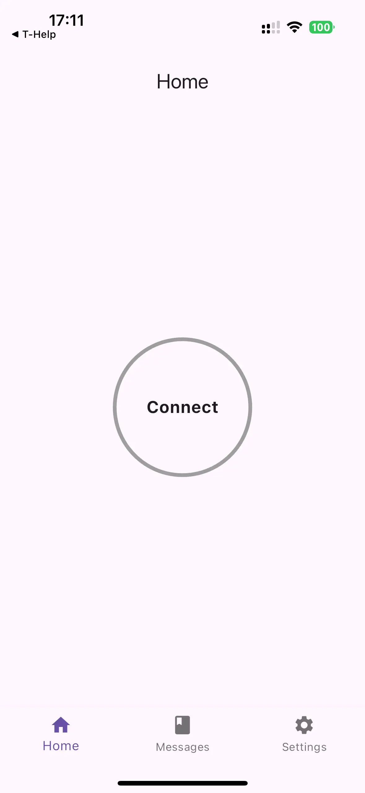

# ble_app

BLE app that scans BLE predefined service characteristic and notifies each 10 second its value.




## Getting Started

```sh
PROJECT_NAME="ble_app"
flutter create --project-name $PROJECT_NAME --platforms ios,android --org org.example $PROJECT_NAME
```

Make sure Info.plist is configured correctly:

```xml
    <!-- Bluetooth Permissions -->
    <key>NSBluetoothAlwaysUsageDescription</key>
    <string>This app requires Bluetooth to scan for and connect to BLE devices.</string>
    <key>NSBluetoothPeripheralUsageDescription</key>
    <string>This app needs Bluetooth to communicate with your devices.</string>

    <!-- Location Permissions -->
    <key>NSLocationWhenInUseUsageDescription</key>
    <string>Location is required to detect nearby Bluetooth devices.</string>
    <key>NSLocationAlwaysUsageDescription</key>
    <string>Location is required in the background to connect to your BLE devices.</string>

    <!-- Background Modes -->
    <key>UIBackgroundModes</key>
    <array>
        <string>bluetooth-central</string>
        <string>location</string>
    </array>
```
